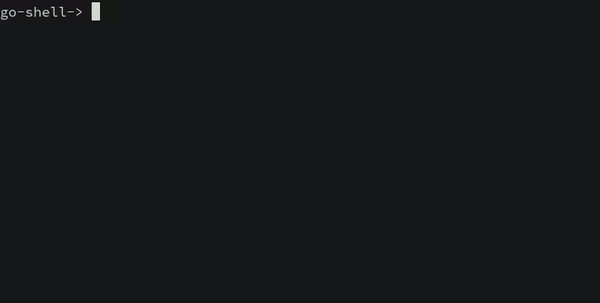
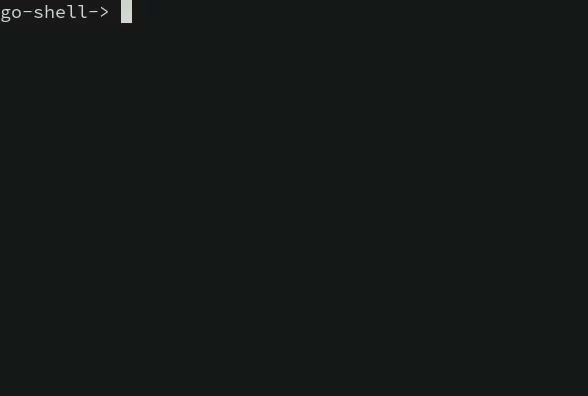

# Go Shell
Inspired by Stephan Brennan's [shell tutorial](https://brennan.io/2015/01/16/write-a-shell-in-c/), I was curious to see what would it take to write a shell in **Go** instead of **C**. Well, it turned out to be incredibly easy because: 

1. **Go** provides nice wrapper functions around `fork()`  and `execute()` using `Cmd` type and its methods found in`os/exec` package.
2. **Go** provides an elegant implementation to signal handling. Instead of creating a complicated signal handler like in **C**, we can simple use `os/signal` to `notify()` a certain channel with the signal and take the appropriate action in response to the signal. 

Note: this is an extremely naive implementation of the shell. Nonetheless, it was pretty fun to implement and learn about `syscall` and `os` stuff in **Go** 😊

​						 

**Wanna see a cool trick?**

​						

Isn't that cool? My `go-shell` can run itself 😁

**Wanna see another cool trick because my go-shell doesn't support pipelining?**

​						

Isn't that funny 😝 CS is just fascinating 💙

### Build

`go build -o go-shell cmd/main.go`

